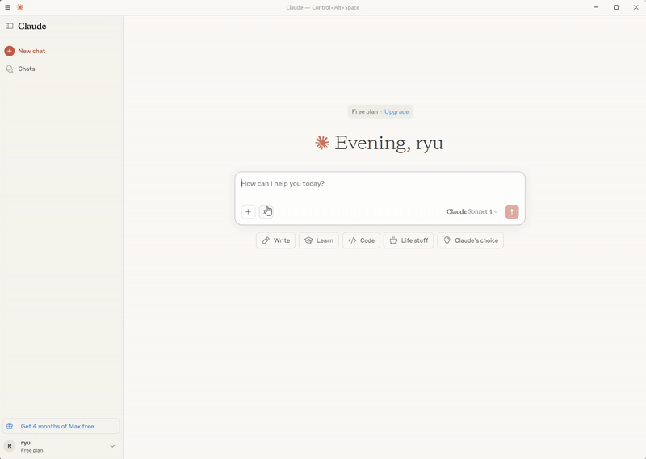
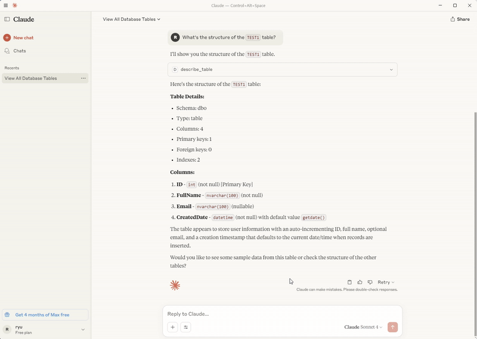
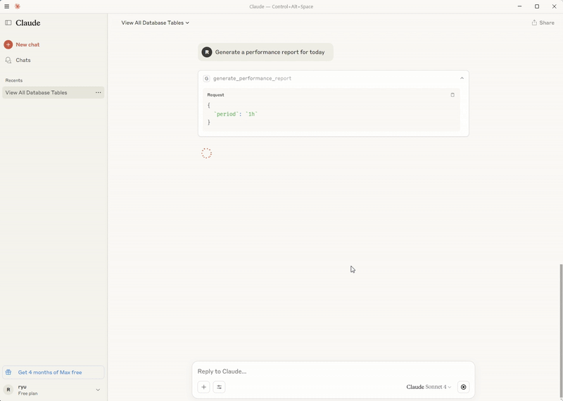

# MCP SQL Server


<!--  -->

A Model Context Protocol server that provides comprehensive access to SQL
databases, starting with MSSQL support. This server enables AI assistants to
inspect database schemas, execute queries, and perform database operations with
enterprise-grade security and performance monitoring.

**Current Status: MSSQL fully supported.** _MySQL and PostgreSQL support coming_
in future releases.

## ✨ Key Features

<!-- 

 -->


- **Database Support**: Full MSSQL support (MySQL and PostgreSQL coming soon)
- **Schema Inspection**: Comprehensive database structure analysis and metadata
  extraction
- **Query Execution**: Safe SQL execution with parameterized queries and result
  formatting
- **Performance Monitoring**: Real-time metrics, query statistics, and
  performance reports
- **Security First**: SQL injection prevention, connection encryption, and
  access controls
- **Batch Operations**: Efficient bulk query execution and transaction
  management
- **Connection Pooling**: Optimized connection management with configurable pool
  settings
- **MCP Integration**: Native support for Claude Desktop, Cursor, and other
  MCP-compatible tools

## 📦 Installation & Setup

### Prerequisites

- **Node.js 18.0.0+** - [Download here](https://nodejs.org/)
- **Database Server**: Microsoft SQL Server (MSSQL)
- **AI Assistant**: Claude Desktop, Cursor, or any MCP-compatible tool

> **Note**: Currently only MSSQL is supported. MySQL and PostgreSQL support will
> be added in future releases.

### Quick Installation

```bash
# Install globally via NPM
npm install -g @donggyunryu/mcp-sql
```

### Basic Configuration

> Refer to `env.example`

Create a `.env` file with your database settings:

```bash
# Create .env file with your database settings
# DB_TYPE=mssql # Current only MSSQL supported
DB_HOST=localhost
DB_PORT=1433
DB_DATABASE=your_database
DB_USER=your_username
DB_PASSWORD=your_password
DB_ENCRYPT=false
DB_TRUST_SERVER_CERTIFICATE=true
```

### Test Connection

```bash
# Test your database connection
npm run test:db # in local environment

#or
npx @donggyunryu/mcp-sql test:db
```

## 🚀 Quick Start

### Local Environment

1. Clone the repository:

   ```bash
   git clone https://github.com/ryudg/mcp-sql.git
   cd mcp-sql
   ```

2. Install dependencies

   ```bash
   npm install
   ```

3. Build the project

   ```bash
   npm run build
   ```

4. Add to your `mcp.json` or `setting.json`, `claude_desktop_config.json`
   ```json
   {
     "mcpServers": {
       "mcp-sql": {
         "command": "node",
         "args": ["/full/path/to/mcp-mysql/build/index.js"],
         "env": {
           // "DB_TYPE": "mssql", # Current only MSSQL supported
           "DB_SERVER": "localhost",
           "DB_PORT": "1433",
           "DB_DATABASE": "your_database",
           "DB_USER": "your_username",
           "DB_PASSWORD": "your_password",
           "DB_ENCRYPT": "false",
           "DB_TRUST_SERVER_CERTIFICATE": "true",
           "NODE_ENV": "development",
           "LOG_LEVEL": "info"
         }
       }
     }
   }
   ```

### Configure AI Assistant

**For Claude Desktop:**

Add to your `claude_desktop_config.json`:

```json
{
  "mcpServers": {
    "mcp-sql": {
      "command": "npx",
      "args": ["-y", "@donggyunryu/mcp-sql"],
      "env": {
        // "DB_TYPE": "mssql", # Current only MSSQL supported
        "DB_HOST": "localhost",
        "DB_PORT": "1433",
        "DB_DATABASE": "your_database",
        "DB_USER": "your_username",
        "DB_PASSWORD": "your_password",
        "DB_ENCRYPT": "false",
        "DB_TRUST_SERVER_CERTIFICATE": "true"
      }
    }
  }
}
```

**For Cursor(VSCode, Windsurf... etc IDE):**

Add to your MCP settings:

```json
{
  "mcpServers": {
    "mcp-sql": {
      "command": "npx",
      "args": ["-y", "@donggyunryu/mcp-sql"],
      "env": {
        // "DB_TYPE": "mssql", # Current only MSSQL supported
        "DB_HOST": "localhost",
        "DB_PORT": "1433",
        "DB_DATABASE": "your_database",
        "DB_USER": "your_username",
        "DB_PASSWORD": "your_password",
        "DB_ENCRYPT": "false",
        "DB_TRUST_SERVER_CERTIFICATE": "true"
      }
    }
  }
}
```

### Start Using

Restart your AI assistant and try:

```
"Show me all tables in my database"
"What's the structure of the users table?"
"Find all active users from the last 30 days"
```

## 💬 Usage Examples

### Schema Exploration

```
"Show me all tables in the database"
"What's the structure of the users table?"
"List all columns in the orders table with their data types"
```

### Data Queries

```
"Find all active users registered in the last 30 days"
"Show me the top 10 customers by total order value"
"Get all pending orders from this month"
```

### Performance Monitoring

```
"Show me current connection pool status"
"What are the slowest queries in the last hour?"
"Generate a performance report for today"
```

## 🛠️ Available Tools

The MCP SQL server provides the following tools for database interaction:

### Schema & Discovery Tools

| Tool                    | Description                       | Parameters                                     |
| ----------------------- | --------------------------------- | ---------------------------------------------- |
| `list_tables`           | List all tables in database       | `pattern` (optional): Filter pattern           |
| `describe_table`        | Get detailed table structure      | `table_name`: Name of table to describe        |
| `get_schema`            | Get complete database schema      | `include_system_tables`: Include system tables |
| `get_schema_statistics` | Get schema statistics information | None                                           |

### Query Execution Tools

| Tool                     | Description                       | Parameters                                              |
| ------------------------ | --------------------------------- | ------------------------------------------------------- |
| `execute_query`          | Execute SQL queries safely        | `query`: SQL statement<br>`parameters`: Bind parameters |
| `start_batch_processing` | Process multiple queries in batch | `queries`: Array of SQL statements                      |

### Performance & Monitoring Tools

| Tool                           | Description                          | Parameters                           |
| ------------------------------ | ------------------------------------ | ------------------------------------ |
| `get_connection_pool_status`   | Get database connection pool status  | None                                 |
| `get_query_stats`              | Get query execution statistics       | `period`: Time period (optional)     |
| `start_performance_monitoring` | Start performance monitoring         | `interval`: Monitoring interval (ms) |
| `generate_performance_report`  | Generate performance analysis report | `timeRange`: Report period           |
| `clear_caches`                 | Initialize cache data                | None                                 |

## 🛡️ Security

- **Connection Encryption**: TLS/SSL connection support
- **Parameter Binding**: SQL injection prevention
- **Access Control**: Database user permission-based control
- **Logging**: Complete query execution logging
- **Input Validation**: Comprehensive input sanitization

### Security Best Practices

- Use dedicated database users with minimal required permissions
- Enable SSL/TLS encryption for database connections when possible
- Use connection pooling with appropriate limits
- Never commit credentials to version control
- Use environment variables for all sensitive configuration

## 🗺️ Roadmap

### Upcoming Features

- **🔮 Multi-Database Support**

  - MySQL adapter implementation
  - PostgreSQL adapter implementation
  - Unified database interface

- **⚡ Performance & Caching**

  - Query result caching system
  - Advanced performance optimization
  - Connection pool enhancements

- **🧪 Testing & Quality**

  - Comprehensive test coverage (100%)
  - Automated CI/CD pipeline
  - Performance benchmarking

- **🚀 Advanced Features**

  - GraphQL integration support
  - Enhanced monitoring dashboard
  - Plugin architecture for extensibility

- **📊 Analytics & Insights**
  - Advanced query analytics
  - Database performance insights
  - Usage statistics and reporting

**[View CHANGELOG](https://github.com/ryudg/mcp-sql/blob/master/CHANGELOG.md)**

## Support & Community

- **📋 Issues**:
  [Report bugs or request features](https://github.com/ryudg/mcp-sql/issues)
- **💬 Discussions**:
  [Community discussions and Q&A](https://github.com/ryudg/mcp-sql/discussions)
- **📖 Documentation**:
  [Comprehensive guides and API docs](https://github.com/ryudg/mcp-sql/wiki)

## 📝 License

This project is licensed under the MIT License. See the [LICENSE](LICENSE) file
for details.

---

**Made with for the AI-powered development community**

**MCP SQL Server v1.0.0** - Bridging AI and databases
